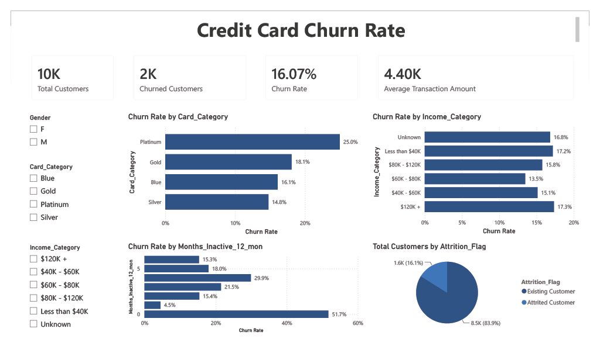

### Credit Card Customer Churn Analysis

## Project Overview

This project analyzes credit card customer churn to identify the characteristics and behaviors associated with customer attrition.

The analysis combines Python, SQL, and Power BI to examine customer demographics, account activity, transaction behaviour, and product usage. The final dashboard is designed to help business stakeholders identify higher-risk customer segments and support more targeted retention strategies.

## Business Questions

This project addresses the following questions:

- What is the overall customer churn rate?
- Which customer segments have the highest churn rates?
- How does churn vary by income category, card type, and customer tenure?
- Is customer inactivity associated with higher churn?
- How do transaction activity and credit utilization differ between churned and existing customers?
- Which indicators could help identify customers who may be at risk of leaving?

## Tools Used
- **Python**: Data cleaning, exploratory data analysis, and visualization
- **Pandas**: Data manipulation and aggregation
- **Matplotlib / Seaborn**: Exploratory charts
- **SQLite**: SQL-based customer analysis
- **Power BI**: Interactive dashboard and business reporting
- **Jupyter Notebook**: Documentation and analysis workflow
- **GitHub**: Version control and project presentation

## Dataset

The dataset contains customer-level credit card information, including:

- Customer age
- Gender
- Income category
- Card category
- Months on book
- Number of inactive months
- Credit limit
- Revolving balance
- Utilization ratio
- Transaction count
- Transaction amount
- Attrition status

The target field is Attrition_Flag, which classifies customers as either:

- Existing Customer
- Attrited Customer

## Project Workflow

1. Imported and inspected the raw customer dataset
2. Checked for missing values, duplicates, and incorrect data types
3. Performed exploratory data analysis in Python
4. Loaded the cleaned data into SQLite
5. Wrote SQL queries to analyze churn across customer segments
6. Created DAX measures and calculated columns in Power BI
7. Built an interactive churn dashboard
8. Summarized business findings and retention recommendations

## Key Performance Indicators

The Power BI dashboard includes the following KPIs:

- Total Customers
- Churned Customers
- Overall Churn Rate
- Average Transaction Amount
- Average Transaction Count

## Dashboard Analysis

The dashboard examines churn by:

- Income category
- Card category
- Customer tenure
- Months inactive
- Age group
- Gender
- Transaction activity
- Credit utilization

Dashboard filters allow users to explore results by customer segment.

## Key Findings

- The overall customer churn rate was approximately **16.07%**.
- Customers with lower transaction activity had a higher likelihood of churn.
- Churn increased among customers with more inactive months during the previous year.
- Certain income and card-category segments showed higher churn rates than others.
- Churned customers generally had lower transaction counts than existing customers.
- Customer behaviour variables appeared to be more informative than demographics alone.

## Business Recommendations

Based on the analysis, the company could:

Identify customers with declining transaction activity before they become inactive
Create retention campaigns for customers with multiple inactive months
Prioritize outreach to customer segments with above-average churn rates
Offer personalized incentives based on card usage and spending behavior
Develop a churn-risk monitoring process using behavioural indicators

## Dashboard Preview

## SQL Analysis

The SQL analysis includes queries for:

- Overall customer churn
- Churn rate by income category
- Churn rate by card category
- Churn rate by customer tenure
- Churn rate by inactivity level
- Average transaction amount by churn status
- Average transaction count by churn status
- Credit utilization by churn status

The queries are available in:

sql/churn_queries.sql

## How to Run the Project

# Python analysis

Install the required packages:

pip install -r requirements.txt

Launch Jupyter Notebook:

jupyter notebook

Open:

notebooks/churn_analysis.ipynb

## SQL analysis

Open credit_churn.db using DB Browser for SQLite and load:

sql/churn_queries.sql

## Power BI dashboard

Open the following file using Power BI Desktop:

dashboard/Credit_Card_Churn.pbix

## Skills Demonstrated
- Data cleaning and validation
- Exploratory data analysis
- SQL aggregation and conditional logic
- Business KPI development
- DAX measures and calculated columns
- Dashboard design
- Customer segmentation
- Churn analysis
- Data storytelling
- Business recommendation development

## Limitations
- The dataset represents a fixed historical snapshot rather than live customer activity.
- The analysis identifies associations but does not prove that specific factors caused churn.
- Additional information, such as customer service interactions, complaints, fees, and campaign history, could improve the analysis.
- A production churn-monitoring system would require regularly refreshed data and model validation.

## Future Improvements

Potential extensions include:

- Building a churn prediction model
- Comparing logistic regression, decision trees, and random forests
- Adding customer risk scores to the dashboard
- Performing cohort analysis
- Connecting Power BI directly to a regularly updated database
- Measuring the financial impact of customer churn

## Author

**Leo Xiao**
